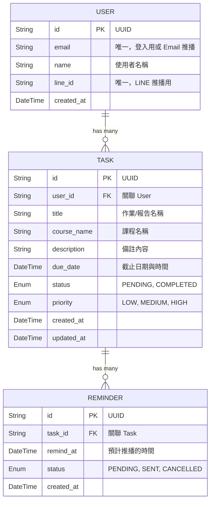

# 作業提醒管理系統 - 資料庫設計文件 (Database Design)

基於先前的 PRD 與架構設計，本系統建議採用 **PostgreSQL** 作為關聯式資料庫，並使用 **Prisma ORM** 進行資料庫操作與遷移 (Migration)。以下是資料庫綱要設計與對應的 Model 程式碼。

## 1. 實體關聯圖 (ER Diagram)



## 2. 資料表說明

1. **User (使用者)**：儲存使用者的基本資料。`email` 作為登入憑證與信件提醒目標，`line_id` 用於綁定使用者的 LINE 帳號以接收 LINE 推播。
2. **Task (作業任務)**：紀錄使用者的各項作業、考試或報告。欄位 `status` 用於記錄繳交狀態（未完成/已完成）。
3. **Reminder (提醒任務)**：由於一個作業可能設定多個提醒時間（例如前一天、前三小時），因此將提醒抽離為獨立資料表。Background Worker 發送前會檢查該 Reminder 所屬的 Task `status`，決定發送或攔截。

## 3. Prisma Schema Model 程式碼

後端建議採用 Prisma ORM，請參考以下 `schema.prisma` 的定義：

```prisma
// schema.prisma

datasource db {
  provider = "postgresql"
  url      = env("DATABASE_URL")
}

generator client {
  provider = "prisma-client-js"
}

model User {
  id        String   @id @default(uuid())
  email     String   @unique
  name      String?
  lineId    String?  @unique
  createdAt DateTime @default(now())

  // 關聯
  tasks     Task[]
}

model Task {
  id          String     @id @default(uuid())
  userId      String
  title       String
  courseName  String?    // 課程名稱，設為可選
  description String?    // 備註說明，設為可選
  dueDate     DateTime   // 截止日期與時間
  status      TaskStatus @default(PENDING)
  priority    Priority   @default(MEDIUM)
  createdAt   DateTime   @default(now())
  updatedAt   DateTime   @updatedAt

  // 關聯
  user        User       @relation(fields: [userId], references: [id], onDelete: Cascade)
  reminders   Reminder[]
}

model Reminder {
  id        String         @id @default(uuid())
  taskId    String
  remindAt  DateTime       // 設定要發送提醒的時間戳
  status    ReminderStatus @default(PENDING)
  createdAt DateTime       @default(now())

  // 關聯
  task      Task           @relation(fields: [taskId], references: [id], onDelete: Cascade)
}

// ---------------- Enum ---------------- //

enum TaskStatus {
  PENDING   // 未完成
  COMPLETED // 已完成
}

enum Priority {
  LOW
  MEDIUM
  HIGH
}

enum ReminderStatus {
  PENDING   // 尚未發送
  SENT      // 已經發送
  CANCELLED // 已取消 (例如任務已完成時自動取消)
}
```
